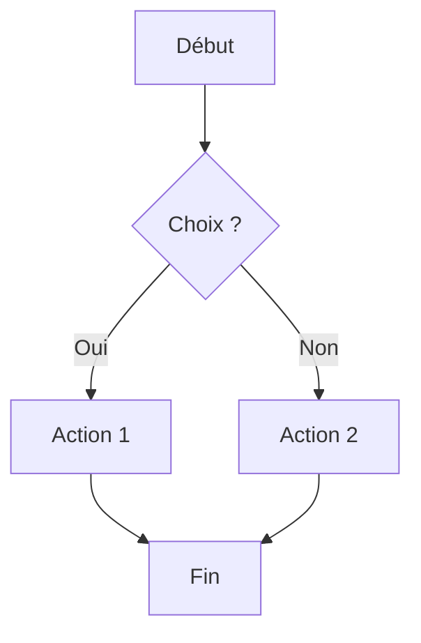

# 🎉 Découvrez Pulse

**Pulse simplifie la création et l'affichage de présentations Markdown (Marp)**
pour les conférenciers et formateurs.

---

## 🎯 Pourquoi Pulse ?

- Écrire vos slides directement dans un éditeur Markdown  
- Visualiser vos présentations **en temps réel**  
- Design moderne et épuré sans effort  
- Réduire le temps de préparation pour les conférences  

---

## ✨ Fonctionnalités clés

1. **Édition simple**
   - Tapez vos slides comme du texte  
   - Utilisez des titres, listes, tableaux et code facilement  

2. **Affichage instantané**
   - Pulse transforme votre Markdown en présentation interactive  
   - Aucun paramétrage complexe nécessaire  

3. **Support complet Marp**
   - Thèmes, couleurs, images et code intégré  
   - Pagination automatique  

4. **Support complet de mermaid**
   - Diagrames
   - Pagination automatique  

---

## 💻 Exemple d’utilisation

> Avec Pulse, cette simple syntaxe devient **une présentation professionnelle**.

---

## 🌟 Avantages pour le conférencier

* Plus besoin de PowerPoint ou Keynote
* Tout est **dans le Markdown**
* Facile à modifier même en dernière minute
* Compatible multi-plateformes (Windows, Mac, Linux)

---

## 🚀 Pulse en action

* Ouvrez votre fichier `.md`
* Modifiez vos slides directement dans l’éditeur
* Affichez la présentation en **plein écran avec Pulse**
* Ajoutez vos notes, images et code en quelques secondes

---

## Exemple de code python

```python
def bonjour(nom: str) -> str:
   return f"Bonjour {nom}"
```

## Exemple de code javascript
```javascript
function bonjour(nom) {
    return `Bonjour ${nom}`;
}
```
---

## 🖋️ Exemple de diagramme Mermaid



> Avec Pulse, vous pouvez intégrer facilement des diagrammes Mermaid directement dans vos présentations Markdown !

---


## 🎉 Conclusion

Pulse rend la création de présentations :

* Simple
* Rapide
* Accessible à tous
* Et surtout **agréable pour le conférencier**

> Fini le stress des logiciels complexes, place à la fluidité et à l’efficacité !